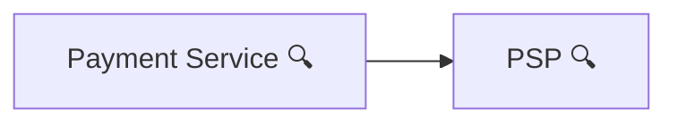
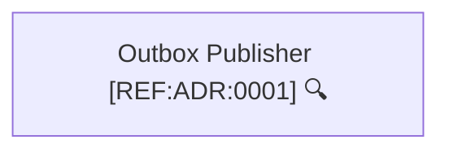

# Universal Architecture Documentation Template (Human + AI Agent Friendly)

This template standardizes documentation so **humans and AI agents** can understand and implement the same system consistently.
It separates **contracts**, **domain rules**, **behavioral flows**, **UI intent**, **architecture views**, and **decisions**.

---

## Repository Layout

```
docs/
├─ contracts/
│  ├─ openapi.<domain>.yaml
│  ├─ asyncapi.<domain>.yaml
│  └─ schemas/
│     └─ <aggregate>.yaml
│
├─ c4/
│  ├─ <domain>-container.md
│  └─ <domain>-components.md
│
├─ flows/
│  ├─ <domain>-flows.md              # index / navigation
│  ├─ <flow-name>.md                 # YAML meta + Mermaid sequence/flowchart
│  └─ ...
│
├─ ui/
│  ├─ <ui-flow>.md                   # YAML meta + Mermaid UI flow
│  └─ ...
│
├─ domain/
│  ├─ invariants.md
│  └─ state-transition-table.md
│
├─ domain-visual/
│  └─ <domain>-state-machine.mmd
│
└─ adr/
   └─ 0001-<decision>.md
```

---

## Authority Order (Conflict Resolution)

If two documents conflict, **higher priority wins**:

1. **contracts/** (OpenAPI/AsyncAPI) – API & event truth
2. **domain/** – invariants and transition rules
3. **domain-visual/** – state machine visuals (allowed transitions)
4. **flows/** – behavior (must comply with 1–3)
5. **ui/** – UX intent (never defines business rules)
6. **c4/** – structure (context/container/component)
7. **adr/** – why (history + rationale)

---

# 1) FLOW DOCUMENTATION

Each `docs/flows/*.md` file contains:
1) a fenced **YAML metadata block** (for agents/CI)
2) a **Mermaid diagram** (for humans)

## 1.1 Flow YAML Metadata Reference

### Required fields

#### `flowId` (required)
A stable identifier for traceability and linking.

Examples:
```yaml
flowId: PAY-CANCEL-V1
flowId: PAY-FINISHED-V1
flowId: REFUND-CREATE-V2
```

#### `trigger` (required)
What initiates the flow. Allowed values (example set):
```yaml
trigger: client
trigger: psp-webhook
trigger: scheduler
trigger: internal
```

#### `preconditions` (required)
Domain conditions that must be true before execution.
```yaml
preconditions:
  allowedStates: [CREATED, AUTHORIZED]
```

#### `sideEffects` (required)
All externally visible outcomes of the flow. Prefer explicit, parseable statements.

**Typical categories (use multiple, as needed):**
1) **State mutation**
```yaml
sideEffects:
  - state: payment -> CANCELLED
```
2) **DB writes**
```yaml
sideEffects:
  - dbWrite: payments.updated
  - dbWrite: outbox.inserted(payment.cancelled.v1)
```
3) **Events (outbox/bus)**
```yaml
sideEffects:
  - event: payment.cancelled.v1
  - event: payment.finished.v1
```
4) **Calls to other services**
```yaml
sideEffects:
  - call: Ledger.createEntry
  - call: Orders.markPaid
```
5) **Security / audit**
```yaml
sideEffects:
  - audit: payment.cancel.requested
```

**Multiple fixed values examples**
If your flow can emit one of several event types (fixed set), list them explicitly:
```yaml
sideEffects:
  - event: payment.finished.v1
  - event: payment.failed.v1
```
If your flow can transition to one of multiple states (fixed set), list each:
```yaml
sideEffects:
  - state: payment -> FINISHED
  - state: payment -> FAILED
```

#### `failures` (required)
Known failure cases (human-readable, but specific).
```yaml
failures:
  - payment not found
  - invalid state transition
  - duplicate webhook event
```

### Optional fields (recommended where relevant)

#### `userStory` (optional, recommended)
Intent only. Never defines rules.
```yaml
userStory:
  as: customer
  iWant: cancel a payment before completion
  soThat: I am not charged for an unwanted order
```

#### `endpoint` (optional)
Links a flow to an API endpoint.
```yaml
endpoint:
  method: POST
  path: /payments/{id}/cancel
```

#### `idempotency` (optional, recommended)
How duplicates are handled.
```yaml
idempotency:
  key: Idempotency-Key header
```
Webhook example:
```yaml
idempotency:
  key: PSP event id or (pspReference + eventType)
```

#### `raceConditions` (optional)
List known concurrency risks.
```yaml
raceConditions:
  - cancel vs capture arriving simultaneously
```

#### `observability` (optional)
Logging/metrics expectations.
```yaml
observability:
  log:
    - payment.cancel.requested
    - payment.cancel.completed
  metrics:
    - payment_cancel_total
    - payment_cancel_latency_ms
```

---

## 1.2 Mermaid in Flows (Links + Magnifier)

Rule: `click` drill-down is supported in `flowchart`/C4 diagrams only. Do not use `click` inside `sequenceDiagram`.


Use a **magnifier icon (🔍)** on nodes that have a drill-down document.
Use Mermaid `click` to link to the target doc.

Example pattern:


Rules:
- Prefer **relative links**
- Link targets should live under `docs/`
- Click targets should exist (CI can enforce)

---

# 2) UI DOCUMENTATION

UI docs express **screen intent and navigation**, not business rules.

Each `docs/ui/*.md` contains:
1) fenced YAML metadata
2) Mermaid UI flow diagram (screens as nodes)

## 2.1 UI YAML Metadata Reference

### Required fields
```yaml
uiFlowId: UI-PAYMENT-CREATE-V1
domain: payment
actors: [customer]
goal: create and complete payment
```

### Optional fields

#### `relatedFlows`
```yaml
relatedFlows:
  - PAY-CREATE-V1
  - PAY-FINISHED-V1
```

#### `uiNotes`
Non-binding UI hints for humans/agents (layout, visibility, style).
```yaml
uiNotes:
  amount:
    intent: guide valid input
    suggestion:
      placement: below-input
      visibility: on-focus
      style: helper-text
  payButton:
    intent: prevent premature submission
    suggestion:
      placement: inline
      visibility: until-form-valid
      style: disabled-primary
```

## 2.2 Mermaid in UI (Links + Magnifier)

Same pattern as flows: nodes with drill-down get 🔍 and `click` targets.

---

# 3) C4 DOCUMENTATION (Context / Container / Component)

C4 docs explain **structure**, not behavior.

Each `docs/c4/*.md` may contain an optional YAML header:

## 3.1 C4 YAML Metadata (Optional)

This metadata is:
- Optional for humans
- Helpful for AI agents and tooling

C4 markdown files may include a lightweight YAML header:

```yaml
view: c4-container        # c4-context | c4-container | c4-component
system: payment           # domain or system name
container: payment-api    # only for component views
scope: high-level         # optional description
```

Examples:
```yaml
view: c4-container
system: payment
```
```yaml
view: c4-component
system: payment
container: payment-api
```

### 3.1.1 C4 Context Diagram

**Answers:**  
What is this system and how does it interact with the outside world?

**Shows:**
- The system as a single box
- Users and roles
- External systems (PSPs, third-party APIs, other domains)

**Does NOT show:**
- Internal services
- Databases
- Implementation details

**Used for:**
- First-time onboarding
- Business and stakeholder communication
- Understanding system boundaries

### 3.1.2 C4 Container Diagram

**Answers:**  
What are the major runtime building blocks of this system?

**Shows:**
- Applications and services (API, worker, UI, batch jobs)
- Databases and message brokers
- Communication paths

**Does NOT show:**
- Classes or methods
- Business logic

**Used for:**
- System architecture discussions
- Deployment and runtime understanding
- Responsibility boundaries

### 3.1.3 C4 Component Diagram

**Answers:**  
How is a single container structured internally?

**Shows:**
- Logical components inside one service
- Controllers, services, repositories, adapters
- Dependency directions

**Does NOT show:**
- Algorithms
- Detailed business rules
- Code-level implementation

**Used for:**
- Developer onboarding
- Refactoring planning
- AI agent guidance for code generation


---

# 4) DOMAIN DOCUMENTATION

- `docs/domain/invariants.md` – absolute business rules (must never be violated)
- `docs/domain/state-transition-table.md` – allowed transitions with triggers/notes
- `docs/domain-visual/*.mmd` – visual-only state machines (no metadata)

---

# 5) CONTRACTS

`docs/contracts/` contains OpenAPI/AsyncAPI and shared schemas.
These are the **source of truth** for:
- endpoints
- request/response payloads
- event names and payloads

---

# 6) ADR (Architecture Decision Records)

ADRs capture **decisions** and **tradeoffs** so future readers (and agents) understand **why the system is the way it is**.
ADRs do not replace contracts or domain rules; they explain rationale and constraints.

## 6.1 ADR File Naming and Numbering

Recommended filename pattern:
- `docs/adr/0001-outbox-pattern.md`
- `docs/adr/0002-idempotency-keys.md`
- `docs/adr/0003-event-versioning.md`

Rules:
- The 4-digit prefix is a **monotonic sequence** (`0001`, `0002`, `0003`, ...).
- **Never reuse** a number.
- Keep the slug short and kebab-case.

### How to handle changes

ADRs are treated as historical records:
- If the decision is still valid but needs clarification: append a small “Clarifications” note (optional) without changing the original intent.
- If the decision changes (new direction): create a new ADR with the next number and reference the old one as superseded.

Example:
- `0004-switch-from-kafka-to-nats.md` (supersedes `0003-event-bus-kafka.md`)

## 6.2 ADR Statuses (Suggested Set)

Use one of these statuses (keep it a fixed set for consistency):

- **Proposed**: draft, under discussion, not approved yet
- **Accepted**: approved and should be implemented or already implemented
- **Rejected**: considered but explicitly not chosen
- **Superseded**: replaced by a newer ADR (link to the replacing ADR)
- **Deprecated**: still in place but should be phased out (usually followed by a superseding ADR)
- **Implemented** (optional): accepted and implemented (use if you want to track execution separately)

Tip: Many teams use a smaller subset: Proposed, Accepted, Superseded, Rejected.

## 6.3 Recommended ADR Headings and Meaning

A minimal, consistent ADR layout:

- **Title**: short human summary (e.g., “Outbox Pattern”)
- **Status**: one of the statuses above
- **Context**: what problem and constraints led to considering this decision
- **Decision**: what was decided (short, explicit)
- **Rationale**: why this choice was made (tradeoffs, pros and cons)
- **Consequences**: what this decision implies (costs, migrations, operational impact)
- **Alternatives** (optional): what else was considered and why not chosen
- **References** (optional): links to docs, PRs, issues, external sources

### Superseding guidance

When an ADR is superseded:
- In the old ADR, set `Status: Superseded` and point to the new ADR (one-line link).
- In the new ADR, mention `Supersedes: ADR-000X` in Context or as a short header line.

## 6.4 Agent Rules for ADRs

Agents must treat ADRs as:
- rationale and constraints, not executable rules
- secondary to contracts, domain, and flows

Agents should:
- apply ADR constraints when generating designs (e.g., “must use outbox”)
- never invent new ADRs unless explicitly asked

# 7) MERMAID LINKING & DRILL-DOWN STANDARD (IMPORTANT)

Due to GitHub and VS Code renderer limitations, **Mermaid `click` MUST NOT be used for `.md` navigation**.

Instead, this repository uses a **reference-id based drill-down standard**.

### Rule (mandatory)

- Mermaid diagrams **do not contain file links**
- Drill-down nodes include a **reference id** in their label
- Actual links are provided **below the diagram as Markdown**

---

## Reference ID Convention

Format:
```
[REF:<TYPE>:<ID>]
```

Examples:
- `[REF:ADR:0001]`
- `[REF:FLOW:PAY-CANCEL-V1]`
- `[REF:C4:PAYMENT-COMPONENTS]`
- `[REF:CONTRACT:ASYNCAPI-PAYMENTS]`
- `[REF:UI:UI-PAYMENT-CREATE-V1]`

---

## Example (C4 Component)



```md
🔍 **References**
- [REF:ADR:0001] [ADR-0001 Outbox Pattern](../adr/0001-outbox-pattern.md)
```

This guarantees:
- GitHub compatibility
- VS Code compatibility
- Agent-safe parsing
- Stable navigation even after repo moves

---

# Mental Model

- What happens? → flows
- Is it allowed? → domain
- How does it look? → ui
- What exists and talks to what? → c4
- Why was this chosen? → adr