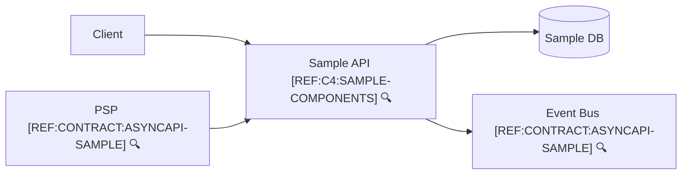

```yaml
view: c4-container
system: sample
```



🔍 **References**
- [REF:C4:SAMPLE-COMPONENTS] [Sample API Components](components.sample.md)
- [REF:CONTRACT:ASYNCAPI-SAMPLE] [AsyncAPI – Sample Events](../contracts/asyncapi.sample.yaml)
