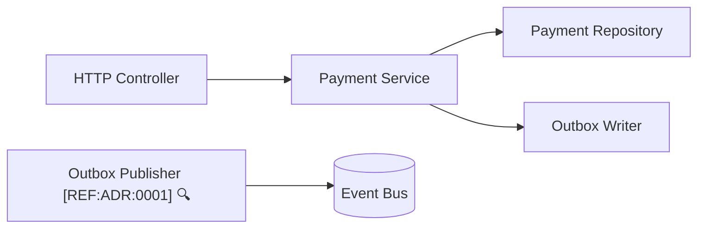

```yaml
view: c4-component
system: payment
container: payment-api
```


```mermaid
flowchart LR
  Ctrl["HTTP Controller"]
  Svc["Payment Service"]
  Repo["Payment Repository"]
  Outbox["Outbox Writer"]
  Pub["Outbox Publisher [REF:ADR:0001] 🔍"]
  Bus[(Event Bus)]

  Ctrl --> Svc --> Repo
  Svc --> Outbox
  Pub --> Bus
```

🔍 **References**
- [REF:ADR:0001] [ADR-0001 Outbox Pattern](../adr/0001-outbox-pattern.md)