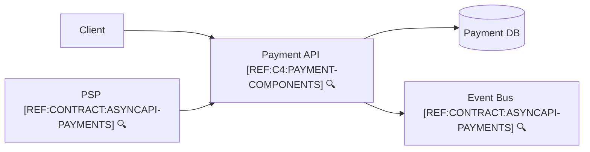

```yaml
view: c4-container
system: payment
```



🔍 **References**
- [REF:C4:PAYMENT-COMPONENTS] [Payment API Components](payment-components.md)
- [REF:CONTRACT:ASYNCAPI-PAYMENTS] [AsyncAPI – Payment Events](../contracts/asyncapi.payments.yaml)