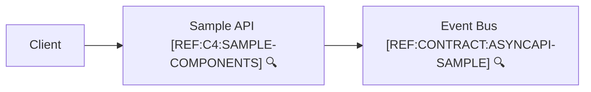
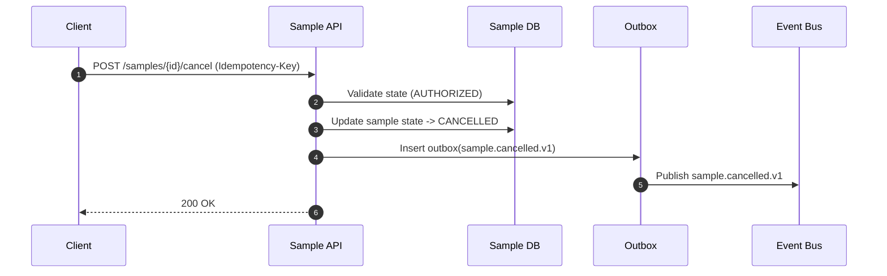

```yaml
flowId: SAMPLE-CANCEL-V1
userStory:
  as: customer
  iWant: cancel a sample before completion
  soThat: I am not charged for an unwanted order
trigger: client
endpoint:
  method: POST
  path: /samples/{id}/cancel
preconditions:
  allowedStates: [AUTHORIZED]
idempotency:
  key: Idempotency-Key header
sideEffects:
  - state: sample -> CANCELLED
  - dbWrite: samples.updated
  - dbWrite: outbox.inserted(sample.cancelled.v1)
  - event: sample.cancelled.v1
failures:
  - sample not found
  - invalid state transition
observability:
  log:
    - sample.cancel.requested
    - sample.cancel.completed
  metrics:
    - sample_cancel_total
```



🔍 **References**
- [REF:C4:SAMPLE-COMPONENTS] [Sample API Components](../c4/components.sample.md)
- [REF:CONTRACT:ASYNCAPI-SAMPLE] [AsyncAPI – Sample Events](../contracts/asyncapi.sample.yaml)


