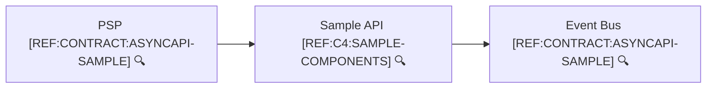
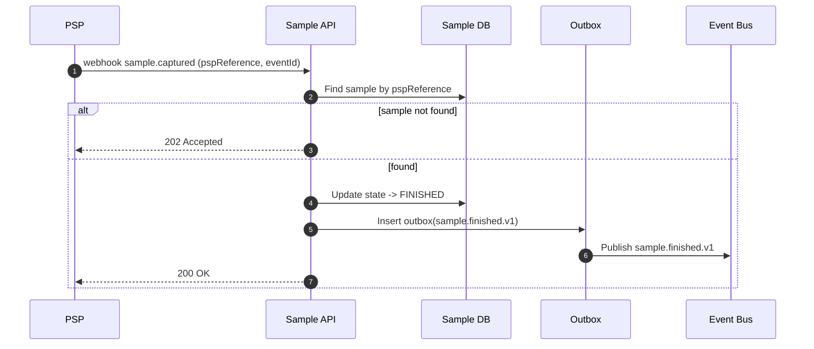

```yaml
flowId: SAMPLE-FINISHED-V1
userStory:
  as: psp
  iWant: notify capture result
  soThat: the merchant updates order status
trigger: psp-webhook
preconditions:
  allowedStates: [AUTHORIZED]
idempotency:
  key: PSP event id or (pspReference + eventType)
sideEffects:
  - state: sample -> FINISHED
  - dbWrite: samples.updated
  - dbWrite: outbox.inserted(sample.finished.v1)
  - event: sample.finished.v1
failures:
  - sample not found
  - duplicate webhook event
raceConditions:
  - capture vs cancel arriving simultaneously
```



🔍 **References**
- [REF:CONTRACT:ASYNCAPI-SAMPLE] [AsyncAPI – Sample Events](../contracts/asyncapi.sample.yaml)
- [REF:C4:SAMPLE-COMPONENTS] [Sample API Components](../c4/components.sample.md)


