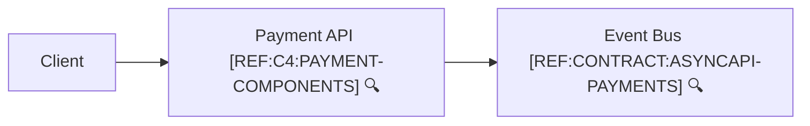
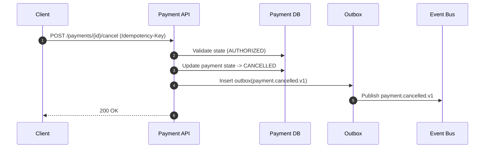

```yaml
flowId: PAY-CANCEL-V1
userStory:
  as: customer
  iWant: cancel a payment before completion
  soThat: I am not charged for an unwanted order
trigger: client
endpoint:
  method: POST
  path: /payments/{id}/cancel
preconditions:
  allowedStates: [AUTHORIZED]
idempotency:
  key: Idempotency-Key header
sideEffects:
  - state: payment -> CANCELLED
  - dbWrite: payments.updated
  - dbWrite: outbox.inserted(payment.cancelled.v1)
  - event: payment.cancelled.v1
failures:
  - payment not found
  - invalid state transition
observability:
  log:
    - payment.cancel.requested
    - payment.cancel.completed
  metrics:
    - payment_cancel_total
```



🔍 **References**
- [REF:C4:PAYMENT-COMPONENTS] [Payment API Components](../c4/payment-components.md)
- [REF:CONTRACT:ASYNCAPI-PAYMENTS] [AsyncAPI – Payment Events](../contracts/asyncapi.payments.yaml)


