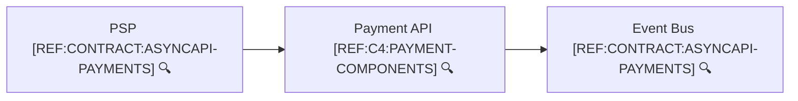
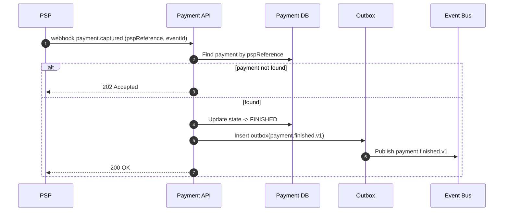

```yaml
flowId: PAY-FINISHED-V1
userStory:
  as: psp
  iWant: notify capture result
  soThat: the merchant updates order status
trigger: psp-webhook
preconditions:
  allowedStates: [AUTHORIZED]
idempotency:
  key: PSP event id or (pspReference + eventType)
sideEffects:
  - state: payment -> FINISHED
  - dbWrite: payments.updated
  - dbWrite: outbox.inserted(payment.finished.v1)
  - event: payment.finished.v1
failures:
  - payment not found
  - duplicate webhook event
raceConditions:
  - capture vs cancel arriving simultaneously
```



🔍 **References**
- [REF:CONTRACT:ASYNCAPI-PAYMENTS] [AsyncAPI – Payment Events](../contracts/asyncapi.payments.yaml)
- [REF:C4:PAYMENT-COMPONENTS] [Payment API Components](../c4/payment-components.md)


