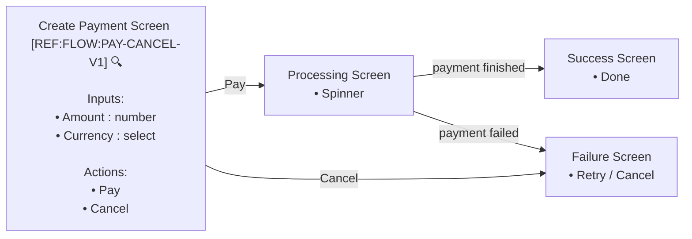

```yaml
uiFlowId: UI-PAYMENT-CREATE-V1
domain: payment
actors: [customer]
goal: create and complete payment
relatedFlows: [PAY-FINISHED-V1, PAY-CANCEL-V1]
uiNotes:
  amount:
    intent: guide valid input
    suggestion:
      placement: below-input
      visibility: on-focus
      style: helper-text
  payButton:
    intent: prevent premature submission
    suggestion:
      placement: inline
      visibility: until-form-valid
      style: disabled-primary
  cancelButton:
    intent: allow user to exit without charge
    suggestion:
      placement: inline
      visibility: always
      style: secondary
```



🔍 **References**
- [REF:FLOW:PAY-CANCEL-V1] [Flow – Payment Cancel](../flows/payment-cancel.md)
